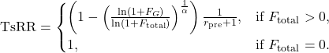

# TsRR: Tie-sensitive Reciprocal Rank

TsRR is a ranking metric designed for information retrieval systems that properly account for tied relevance scores. Ties occur when multiple documents receive identical scores, which can lead to misleading evaluations with traditional Mean Reciprocal Rank (MRR). TsRR addresses this challenge by penalizing excessive ties while still rewarding systems that distinguish truly relevant documents.

## Motivation

In many learning-to-rank scenarios, multiple documents may receive the same relevance score for a given query. Standard metrics assume a strict ranking order and may overestimate performance when ties are present. For example, in a fully tied scenario (i.e., when a system makes no distinctions between documents), the expected rank of a relevant document can be deceptively favorable. TsRR was proposed to counter this paradox by:

- **Mitigating over-rewarding of fully tied rankings:** Systems that group too many items together receive a substantial penalty.
- **Maintaining computational efficiency:** TsRR uses simple logarithmic and multiplicative operations.
- **Adapting flexibly to tie scenarios:** The tunable parameter  adjusts the sensitivity of the tie penalty.

## The TsRR Formula

For a given target document (or query), let:

-  be the number of documents ranked before the tie group that contains at least one relevant document.
-  denote the tie group that contains the relevant document(s).
-  be the number of relevant documents within .
-  be the number of irrelevant (false positive) documents in the tie group.
-  be the total number of irrelevant documents retrieved.
-  be a parameter governing the sensitivity of the tie penalty.

Then, TsRR is defined as:



### How It Works

1. **Tie Handling:**  
   The logarithmic term ) grows sublinearly, which means that even if many irrelevant documents are tied with the relevant ones, the penalty is moderated. Normalizing by ) scales the penalty in context of the overall retrieval performance.

2. **Rank Rewarding:**  
   Multiplying by  rewards systems that rank the tie group (containing at least one relevant document) higher in the list.

3. **Parameter :**  
   The sensitivity parameter adjusts how harshly the metric penalizes ties:
   - Lower  values (e.g., 0.5 or 1.0) are more forgiving.
   - Higher  values (e.g., 2.0 or 4.0) impose a stricter penalty on ties.

### An Illustrative Comparison

Consider two scenarios:

- **Fully Tied System:**  
  All retrieved documents have the same score. Suppose there is one relevant document among  documents. In a fully tied scenario, every position is equally likely, so the expected position is:

  

  and the reciprocal rank (ta-RR) becomes:

  

- **Distinct Ranking System:**  
  Suppose a system places the relevant document at rank  (with no ties around it). Then:
  - 
  - The expected position within the tie group is 1, so the reciprocal rank is:

  

If , then:

  

This shows that a fully tied system might score higher than a system that ranks the relevant document lower. TsRR corrects this by penalizing ties appropriately.

## Requirements

- **[NumPy](https://numpy.org/)** (the only dependency)

## Installation

Clone the repository and install NumPy:

```bash
git clone https://github.com/yourusername/tsrr.git
cd tsrr
pip install numpy
